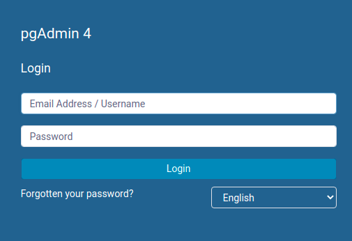
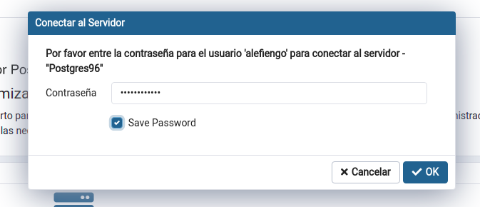

# docker-postgresql96-pgadmin4
DBA Docker - Postgres 9.6 + Pgadmin4

## Prerrequisitos

* [Docker Engine](https://docs.docker.com/engine/install/)
* [Docker Compose](https://docs.docker.com/compose/install/)

## Desplegar contenedores

### Pasos

1) Clonar el repositorio
```
git clone https://github.com/alefiengo/docker-postgresql96-pgadmin4
```

2) Dentro del directorio `docker-postgresql96-pgadmin4`, ejecutar
```
docker-compose up -d --build
```

## Explorar
### Pasos

1) Desde un navegador, ingresar a la URL `http://localhost:5050`

2) En el formulario ingresar las siguientes credenciales:

* Correo electrónico / Username: jose.fiengo.vega@gmail.com
* Contraseña: Alefiengo123



3) Posteriormente, en el campo contraseña, ingresar: `alefiengo123`

